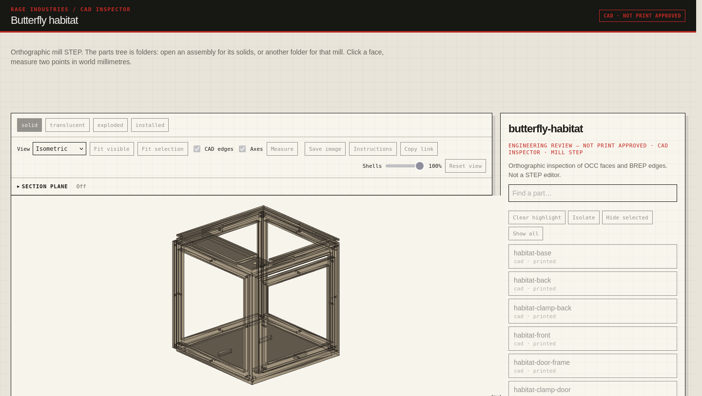
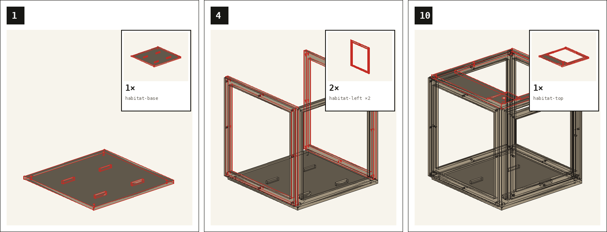

# Printables

An agent writes one manufacturing contract, builds the part, and exports one STL per body. The run fails closed. VibeCAD is the dimensional kernel. The only CAD inspector is `3d-print-cad-render`. A render is not print approval.

OpenSCAD is not the dimensional kernel. It stays in the tree for CI sample exports, a prompt that names OpenSCAD, and hosts where VibeCAD cannot run. Upstream FreeCAD is not a supported kernel. Blender is organic or lattice only.

## How it fits

```text
ChArUco photo → 3d-print-photo-cad (board plane only) → named millimetres in PRINT_SPEC
PRINT_SPEC.yaml → VibeCAD → one STL per body → validate_project.py → validate_assembly.py
                         ↘ STEP → 3d-print-cad-render (the only CAD inspector)
                                    ↘ Instructions → 3d-print-lego-instructions
                                    ↘ required sequence → 3d-print-ikea-instructions
                         ↘ HARD=0 → 3d-print-pack → 3d-print-slice
```

Markdown is narrative only. `docs/DESIGN.md` is never parsed. An assembly is multiple `geometry.stl_files` entries.

Also in the pack, on the same contract and the same validator: two-piece display enclosures, image silhouettes, and a shop-fixture decision to print or buy. Printer upload lives in the sibling `bambu-mcp` repo. This pack never stores an access code, a serial, or a LAN IP.

## How-to

Each block is the command, what done looks like, and the limit that sits beside the claim.

### Contract

Write `docs/PRINT_SPEC.yaml` before any CAD. Every critical dimension has a name, a millimetre value, a tolerance, and a provenance.

```bash
python3 skills/3d-print-design-brief/scripts/validate_print_spec.py \
  docs/PRINT_SPEC.yaml
```

Done: the validator exits 0. An assembly is several `geometry.stl_files` entries, one STL per body that is printed on its own.

Limit: `docs/DESIGN.md` is never parsed. An assumed critical fit cannot ship.

### VibeCAD

Dimensional mechanical geometry uses [10-X-eng/vibecad](https://github.com/10-X-eng/vibecad). That is the dimensional kernel. It is not the PyPI package named vibecad.

```bash
python3 skills/3d-print-vibecad/scripts/find_vibecad.py status
python3 skills/3d-print-vibecad/scripts/find_vibecad.py download   # x86_64 only
export VIBECAD_CMD=...   # printed by the status command
```

Done: one STL per independently printed body, then `validate_project.py` reports HARD=0.

Limit: this pack does not vendor VibeCAD. The Linux ARM qemu-x86_64 AppImage is unsupported. Boolean welding of overlapping solids stays open until a live one-solid export. Do not point `VIBECAD_CMD` at upstream FreeCAD.

### Inspector

`3d-print-cad-render` is the Rage CAD inspector: parts tree, measure, OCC faces, and BREP edges. The butterfly habitat stills below were packed with this skill.

```bash
export QT_QPA_PLATFORM=offscreen
export FREECAD_CMD=/path/to/FreeCADCmd
python3 skills/3d-print-cad-render/scripts/render_cad_project.py \
  --project "$PROJECT" --serve --port 8107
```

Open `http://127.0.0.1:8107/?view=solid`.

Done: the page loads on loopback, the parts tree lists the study, and measure reports world millimetres.

Limit: loopback only. This pack does not ship a network proxy or a FreeCAD binary. An STL is not a CAD view. `./install.sh` does not copy this skill, so a profile-local copy is not overwritten. The inspector is not a mill and not print approval.

### Lego or IKEA

A named style wins. Say Lego or blueprint when the picture matters more than a single legal order. Say IKEA or one way only when the piece has to go together in one sequence. If both are true, ask before printing a required booklet.

Picture sheet, same order as the inspector Instructions button:

```bash
python3 skills/3d-print-lego-instructions/scripts/render_booklet.py \
  scene.json --out instructions.html --title "Butterfly habitat"
```

Required sequence, one solid per step. This is not the inspector button:

```bash
python3 skills/3d-print-ikea-instructions/scripts/render_ikea_booklet.py \
  scene.json --out ikea.html --title "Assembly"
```

Done: `instructions.html` contains the order rule `centroid z, then y, then x, then name`. `ikea.html` contains `This sequence is required` and one step per solid.

Limit: that order is centroid height. It is not a fastener or mate plan. Identical parts inside a 2 mm Z band share a Lego callout. IKEA never batches them. An IKEA sheet presents one sequence as required. It does not prove another order fails. The public stills show steps 1, 4, and 10 of the butterfly habitat. Step 4 is two side frames.

### ChArUco photo

Use this when a bought part has no drawing and a printed scale board is in the frame. Print the board at 100%. One square must measure 15.0 mm with a ruler.

```bash
python3 skills/3d-print-photo-cad/scripts/charuco_photo.py --board --out ./charuco
python3 skills/3d-print-photo-cad/scripts/charuco_photo.py photo.jpg --out ./charuco
```

Done: `ok: true` means the board square recovered within 0.15 mm. `part_px_are_metric` is false. The solid is then one model in `3d-print-cad-render`, labeled `photo-derived`.

Limit: this is not a caliper. Lengths and hole diameters are not read off the rectified PNG. A raised face is not metric. An official drawing wins and skips the board. OpenCV is required for a real photo and is not installed in unit CI.

### Reverse an STL

Rebuild an existing STL as an editable STEP plus a gated STL. Reconstruction, not triangle conversion.

```bash
skills/3d-print-reverse/scripts/preverse run --stl in.stl --project "$PROJECT"
```

Done: `docs/PRINT_SPEC.yaml` passes, `step/<body>.step` is analytic B-rep, the STL from that solid passes `validate_project.py` with HARD=0, and `reports/<body>.deviation.json` is within `max_deviation_mm`.

Limit: a triangle-wrapped STEP is refused. OpenSCAD and Blender cannot emit editable STEP. Missing OCC (`VIBECAD_CMD` or a pinned `PREVERSE_STEP_IMAGE`) exits 2 and writes no fake STEP. Fillet recovery is best-effort. Proof is mesh deviation against the input STL.

### Pack and slice

After HARD=0, zip the project, then write a process card.

```bash
python3 skills/3d-print-pack/scripts/pack_project.py "$PROJECT"
python3 skills/3d-print-slice/scripts/slice_project.py "$PROJECT"
```

Done: `pack/<part>.zip` holds the spec, source, STLs, `docs/PRINT_NOTES.md`, and `MANIFEST.sha256`. `slice/<body>.process.json` matches the spec. A 3MF appears only when `ORCA_SLICER`, `BAMBU_STUDIO`, or `PRUSA_SLICER` is set.

Limit: the zip is not a slicer project unless slice ran. A missing slicer prints `SKIP: no slicer CLI` and writes no fake 3MF. A validated STL is not permission to print. Live printer control stays in `bambu-mcp`.

### Robotics

The examples in this repo are the 01 rover family: `examples/robot-kit-01-rover`, `examples/robot-kit-01-rover-v2`, and `examples/robot-kit-01-rover-kid`.

```bash
python3 skills/3d-print-validate/scripts/validate_project.py \
  examples/robot-kit-01-rover
python3 skills/3d-print-validate/scripts/validate_assembly.py \
  examples/robot-kit-01-rover
python3 skills/3d-print-sim/scripts/roll_table_flat.py \
  examples/robot-kit-01-rover
```

Done: `validate_project.py` and `validate_assembly.py` both report HARD=0. The same pair passes for v2 and the kid hull.

Limit: print the chassis, wheels, and brackets. Buy the motors, board, and servos. `sim2real: true` needs mass, friction, and actuator coupons from a measurement or a datasheet. A MuJoCo window is not the contract. Modules 02 and 03 are described by the robotics skill and are not in this tree.

## Skill names

All tools use the same prefix, followed by one obvious job:

- `3d-print-design-brief` — define and validate the manufacturing contract
- `3d-print-vibecad` — dimensional mechanical CAD in 10-X-eng/vibecad. Not the PyPI package. Not upstream FreeCAD.
- `3d-print-openscad` — portable and CI export path. OpenSCAD is not the dimensional kernel.
- `3d-print-blender` — organic or lattice CAD; exception backend
- `3d-print-validate` — contract and STL validation
- `3d-print-display-enclosure` — small two-piece display enclosures
- `3d-print-robotics` — numbered FDM micro-robotics kit modules
- `3d-print-sim` — assembled occupancy, joint sweep, and load section check
- `3d-print-image-silhouette` — image-derived stencils and silhouettes
- `3d-print-photo-cad` — millimetres from a printed ChArUco photo, board plane only. Not a caliper. Installed by `./install.sh`. Not in `/3d-print`.
- `3d-print-shop-fixture` — decide whether a shop fixture should be printed or bought
- `3d-print-reverse` — rebuild an existing STL as editable STEP and a gated STL
- `3d-print-pack` — zip a gated project (spec, source, STLs, print notes, manifest)
- `3d-print-slice` — process card from PRINT_SPEC; optional 3MF if a slicer CLI is present
- `3d-print-cad-render` — the only CAD inspector (parts tree, measure, OCC faces and BREP edges). Habitat kits, brackets, and photo-derived solids are viewed here. Not a mill. Not in `./install.sh`, so a profile-local copy is not overwritten.
- `3d-print-lego-instructions` — Lego-style step sheets from a mill STEP. Optional. In `./install.sh`, not in `/3d-print`. Not an LDraw export. Use this when the picture matters more than a single legal order.
- `3d-print-ikea-instructions` — required-sequence sheets from a mill STEP. Optional. In `./install.sh`, not in `/3d-print`. Not an IKEA manual. One solid per step. A named style wins.

The `/3d-print` bundle loads the brief, VibeCAD, OpenSCAD, Blender, and the validator. Dimensional work uses VibeCAD. Use OpenSCAD only when the prompt names it, for CI sample STL export, or when VibeCAD cannot run. Blender is organic or lattice only. `3d-print-cad-render`, `3d-print-lego-instructions`, `3d-print-ikea-instructions`, `3d-print-photo-cad`, `3d-print-reverse`, `3d-print-pack`, and `3d-print-slice` are not required by `/3d-print`. Live printer control is the sibling `bambu-mcp` repo; this pack never stores access codes, serials, or LAN IPs.

VibeCAD (10-X-eng/vibecad, not the PyPI package) uses the same PRINT_SPEC and `validate_project` gates. This pack does not vendor it. Linux ARM qemu-x86_64 AppImage is not supported. Boolean welding of overlapping solids stays a known limit until a live one-solid export. Set `VIBECAD_CMD` or `FREECAD_CMD` to the host `FreeCADCmd`. Do not point that variable at upstream FreeCAD.

## Hard contract

Each project owns `docs/PRINT_SPEC.yaml` with:

- `cad.parametric: true`
- backend chosen from `vibecad` (dimensional default), `openscad` (portable or CI), `blender`, `hybrid`, or optional `cadquery`
- millimetres and Z-up
- explicit X/Y/Z printer build volume
- named CAD parameter for each critical dimension
- nominal value, tolerance, and provenance for each dimension
- one STL per independently manufactured body (an assembly is several entries)
- expected watertight shell count per STL
- overlapping exported solids forbidden
- minimum wall and feature sizes
- clearance stated per side
- fit evidence and coupon policy
- print orientation, bed face, support policy, and overhang limit
- service material and drainage requirements

## Install

Requirements: Linux for CAD backends; Python 3.11+; PyYAML. Dimensional export and STEP dumps need a host `FreeCADCmd` via `VIBECAD_CMD` or `FREECAD_CMD` (10-X-eng/vibecad, not upstream FreeCAD). Docker OpenSCAD is only the CI and portable path. Blender 4.x is only the Blender backend.

```bash
git clone https://github.com/marctheshark3/printables.git
cd printables
python3 -m pip install PyYAML pytest
./install.sh
./install.sh --dry-run
HERMES_PROFILES=default ./install.sh
```

Installation is additive and never deletes profile-local files. Start a new Hermes session after installation.

Optional 10-X-eng/vibecad binary. This pack does not vendor it. Linux ARM qemu-x86_64 AppImage is not supported:

```bash
python3 skills/3d-print-vibecad/scripts/find_vibecad.py status
python3 skills/3d-print-vibecad/scripts/find_vibecad.py download   # x86_64 only
export VIBECAD_CMD=...   # printed by the command
```

## Use

```text
/3d-print bracket for this sensor
```

Without Hermes:

```bash
python3 skills/3d-print-design-brief/scripts/validate_print_spec.py \
  examples/bracket-coupon/docs/PRINT_SPEC.yaml

python3 skills/3d-print-validate/scripts/validate_project.py \
  /path/to/exported-project

python3 skills/3d-print-validate/scripts/validate_assembly.py \
  examples/robot-kit-01-rover

python3 skills/3d-print-validate/scripts/validate_assembly.py \
  examples/robot-kit-01-rover-v2

python3 skills/3d-print-validate/scripts/validate_assembly.py \
  examples/robot-kit-01-rover-kid

python3 skills/3d-print-sim/scripts/roll_table_flat.py \
  examples/robot-kit-01-rover
```


For reverse engineering an existing STL to editable STEP:

```bash
skills/3d-print-reverse/scripts/preverse run --stl in.stl --project "$PROJECT"
```

STEP export needs OCC (`VIBECAD_CMD` or a pinned `PREVERSE_STEP_IMAGE` digest). Analyze through gate does not. Missing kernel exits 2 and never writes a fake STEP.

For the loopback inspector (`3d-print-cad-render`):

```bash
export QT_QPA_PLATFORM=offscreen
export FREECAD_CMD=/path/to/FreeCADCmd
python3 skills/3d-print-cad-render/scripts/render_cad_project.py \
  --project "$PROJECT" --serve --port 8107
```

Loopback only: `http://127.0.0.1:8107/?view=solid`. This pack does not ship a network proxy or a FreeCAD binary. An STL is not a CAD view. The inspector is not a mill and not print approval. `./install.sh` does not copy this skill. The toolbar Instructions button opens the picture sheet; that procedure is `3d-print-lego-instructions`. A required one-way sequence is `3d-print-ikea-instructions`, not that button.

Printable edge-art from an OCC dump, same order as the button:

```bash
python3 skills/3d-print-lego-instructions/scripts/render_booklet.py \
  scene.json --out instructions.html --title "Butterfly habitat"
```

Required sequence, one solid per step. Not the inspector button:

```bash
python3 skills/3d-print-ikea-instructions/scripts/render_ikea_booklet.py \
  scene.json --out ikea.html --title "Assembly"
```

## Sample

The stills are the public [butterfly habitat](https://github.com/marctheshark3/butterfly-habitat) kit, placed the way that repo's viewer compound places the panels. This pack does not vendor that project. Steps 1, 4, and 10 are shown. Step 4 is two side frames. Order is centroid height, not a fastener plan. Not an LDraw model. Not print approval.





For Blender:

```bash
skills/3d-print-blender/scripts/pblend new organic-lid --class enclosure
skills/3d-print-blender/scripts/pblend run --project "$HOME/print-projects/organic-lid"
skills/3d-print-blender/scripts/pblend gate --project "$HOME/print-projects/organic-lid"
```

## Validation

`validate_project.py` fails closed on:

- incomplete or contradictory contract
- missing source or STL
- absolute or parent-traversal project paths
- non-parametric backend declaration
- open, non-manifold, inconsistently oriented, duplicate, or degenerate topology
- wrong connected-shell count
- overlapping exported solids
- non-positive volume
- build-volume overflow
- unacceptable fit or wet-service evidence
- class-specific overhang and open-under failures
- sampled wall thickness below `geometry.min_wall_mm` over more than `thin_wall_area_frac=0.02` of sampled area

When `assembly` is present, `validate_assembly.py` then fail-closes on illegal assembled occupancy, joint self-collision, and missing or assumed required loads. A render is not proof.

`sim2real: true` requires mass, friction, and actuator calibration coupons with measured or datasheet sources. Assumed calibration cannot claim sim2real. A MuJoCo window is not the contract.

Short STL chords are tessellation, not wall thickness. They remain warning-only. Mesh thickness is a sampled inward-ray audit, not an exact-kernel proof.

After HARD=0, `3d-print-pack` writes a deliverable zip. `3d-print-slice` always writes a process card and skips 3MF with `SKIP: no slicer CLI` when no slicer is configured. A validated STL is not permission to print.

## Tests

```bash
python3 -m pytest -q skills/3d-print-design-brief/tests skills/3d-print-validate/tests skills/3d-print-reverse/scripts/tests skills/3d-print-vibecad/scripts/tests skills/3d-print-pack/scripts/tests skills/3d-print-slice/scripts/tests skills/3d-print-cad-render/tests skills/3d-print-lego-instructions/tests skills/3d-print-ikea-instructions/tests skills/3d-print-image-silhouette/tests skills/3d-print-photo-cad/tests tests/test_prompt_scenarios.py tests/test_secret_scan.py
python3 tests/test_skill_contract.py
python3 tests/prompt_harness.py
python3 -m unittest discover -s skills/3d-print-blender/scripts/tests -v
python3 -m py_compile \
  skills/3d-print-design-brief/scripts/*.py \
  skills/3d-print-validate/scripts/*.py \
  skills/3d-print-sim/scripts/*.py \
  skills/3d-print-blender/scripts/pblend_cli.py \
  skills/3d-print-image-silhouette/scripts/*.py \
  skills/3d-print-reverse/scripts/*.py \
  skills/3d-print-pack/scripts/*.py \
  skills/3d-print-slice/scripts/*.py \
  skills/3d-print-vibecad/scripts/find_vibecad.py \
  skills/3d-print-cad-render/scripts/*.py \
  skills/3d-print-lego-instructions/scripts/*.py \
  skills/3d-print-ikea-instructions/scripts/*.py \
  skills/3d-print-photo-cad/scripts/*.py
```

`tests/prompts/` holds sample user prompts. CI ranks them onto skills, then the `generate-stls` job exports real STLs with OpenSCAD/Blender and uploads them as the `generated-stls` artifact. That job is the portable export path, not the dimensional kernel. Shop-fixture prompts stop at buy-vs-print. Inspector and VibeCAD binary steps are not invoked unless `FREECAD_CMD` or `VIBECAD_CMD` is set. No live model.

## License

MIT. See [LICENSE](LICENSE).
